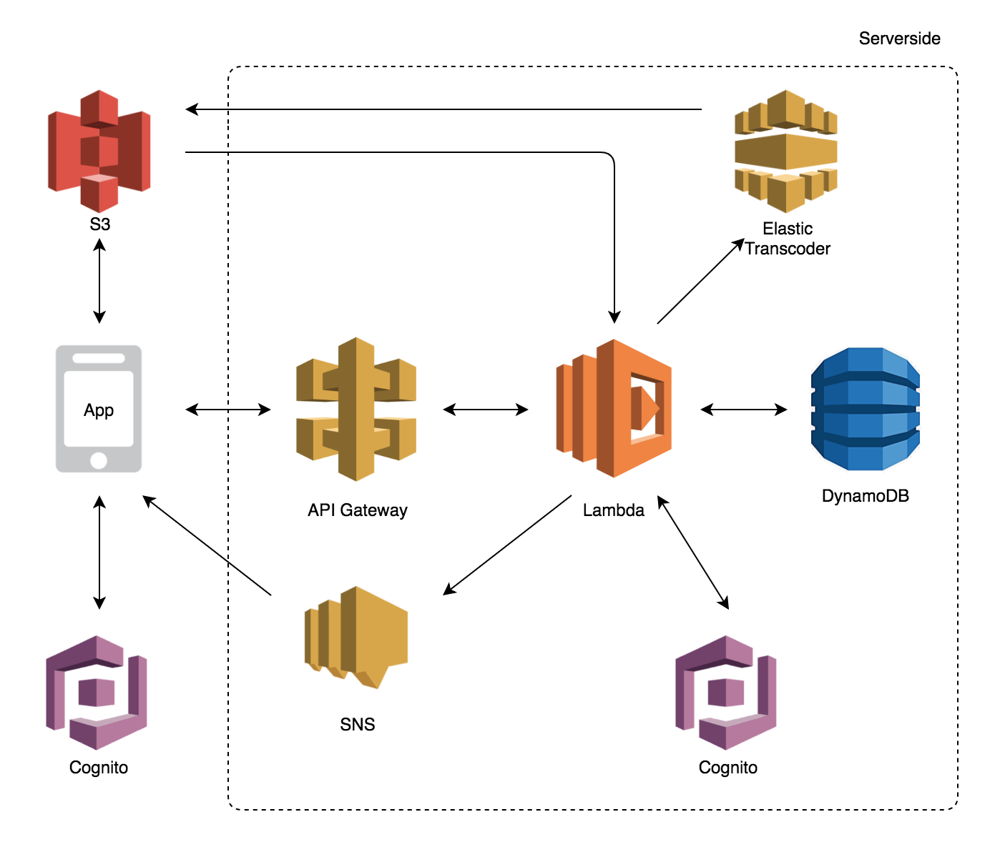

## Arquitetura

A escolha dos serviços e da arquitetura aplicada se deu devido a dois fatores principais, o custo e a escalabilidade. O custo é baixo para aplicações de pequeno e médio porte e competitivo para grandes aplicações, tornando uma solução interessante para novas aplicações. A escalabilidade é inerente da arquitetura serverless e de quase todos os serviços da AWS, dos serviços utilizados nenhum deles é necessário fazer algum tipo de configuração manual, todos eles aumentam sua capacidade sob demanda, o que torna a preocupação com o crescimento muito menos. Além disso todos os serviços possuem alta disponibilidade, tornando o custo com manutenção de infraestrutura quase 0.

### AWS Lambda

- Principal serviço usado pela arquitetura serverless, é usado para executar código sem a necessidade de um servidor dedicado, a cobrança é feita apenas em cima do tempo de execução da função, para o projeto usamos lambda com uma capacidade de 1024mb, com um tempo médio de execução de 156ms, o que resultaria em um custo de aproximadamente $3,5 por milhão de execuções (Com essa utilização de memória temos um total de 400000 execuções de graça)

### AWS API Gateway

- Serviço usado para criação das API, ou seja, a ligação entre um request HTTP e a execução de uma função lambda. O serviço também é usado para criação de domínios customizados para essas APIs. O custo desse serviço é de $3,5 por milhão de chamadas de API (Esse serviço possui um nível gratuito de 1 milhão de chamadas)
### AWS S3
- Serviço de armazenamento de objetos da Amazon, usamos ele para armazenar fotos e vídeos de usuários, além do código do projeto ficar armazenado no S3 para o gerenciamento do mesmo pela Lambda. O custo desse serviço é de $0,023 por GB de dados armazenados, $0,005 a cada 1000 operações de escrita e $0,0004 a cada 1000 operações de leitura , o custo dele depende bastante da utilização dos usuários.
### AWS DynamoDB
- Banco de dados não relacional da AWS, possui escalabilidade inerente, aumentando a sua capacidade conforme o uso. O custo desse serviço é baseado na capacidade das tabelas, a AWS cobra a partir de uma métrica de Read Capacity Unit (RCU) e Write Capacity Unit (WCU), onde o valor mínimo desse serviço é de $0,59 por mês por tabela(Para uma capacidade de leitura é cobrado o valor de $0,09, e para uma capacidade de escrita é cobrado $0,50). A AWS possui um plano gratuito de 25 RCU e 25 WCU.
### AWS SNS
- É o serviço de notificações da AWS, é usado no projeto para o envio de push notifications para os usuários. Possui um custo de $0,50 por milhão de notificação, com um nível gratuito de 1 milhão de notificações por mês.
### AWS Cognito
- Serviço de autenticação e autorização usado tanto nos aplicativos mobile quanto no servidor para garantir que o usuário está autorizado dentro da aplicação. O serviço é gratuito para os 50.000 primeiros usuários, depois é adicionado um custo de $0,0055 por usuário.
### AWS Elastic Transcoder
- Serviço usado para geração de playlists de vídeo com diferentes qualidades, assim não é necessário que os usuários baixem o vídeo bruto na sua qualidade original ao assistir um vídeo no seu feed, e sim limitar a qualidade a partir da qualidade da conexão do usuário. O custo desse serviço depende da quantidade de vídeos dentro da aplicação, o custo por minuto de vídeo transcodificado é de aproximadamente $0,05