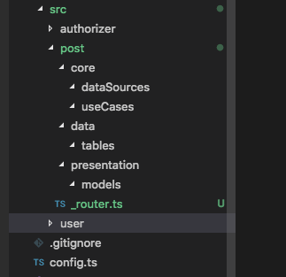
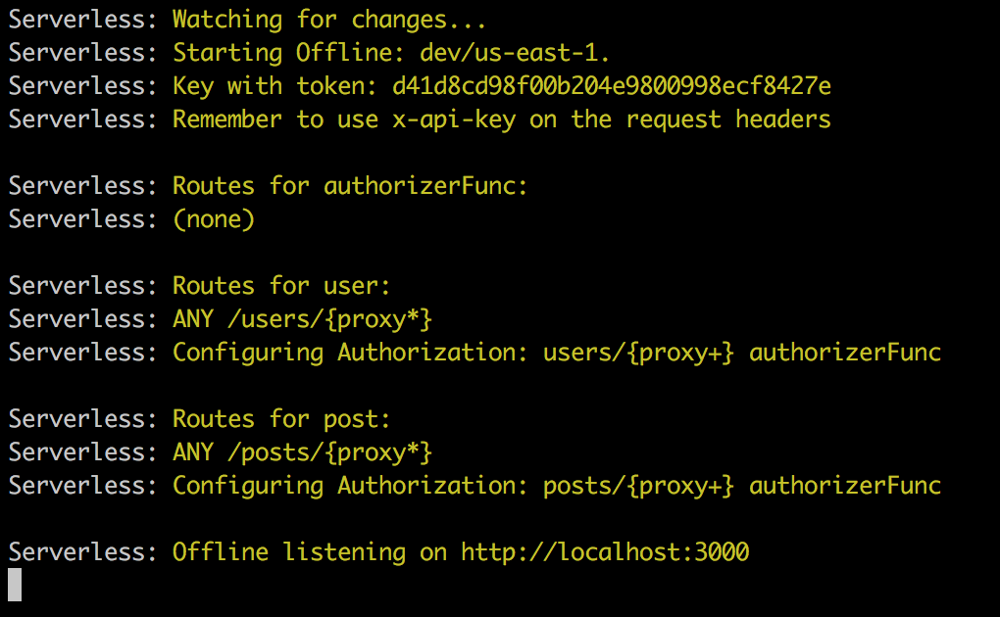

## Creating your first endpoint from scratch

So now we'll try to create a new endpoint, for this tutorial we'll have two scenarions, the first one assumes that we are creating a new service, and the second one assumes that we are only creating a new endpoint for an existing service. So first we'll make a 'create post' endpoint, after that we'll do a 'get post' endpoint, this are simple functions, but very common ones!

### 1. New service, new endpoint, new everything

First we need to add a new function in our serverless.yml, we only need need to copy a previous implementation and change a feel words (like the service name!), since this only defines the lambda you will rarely need to do anything different here.

```yml
functions:
  authorizerFunc:
    handler: src/authorizer/authorizer.handler
  user:
    handler: src/user/_router.router
    events:
      - http:
          method: any
          path: users/{proxy+}
          authorizer: ${self:custom.authorizer}
          private: true
  post:
    handler: src/post/_router.router
    events:
      - http:
          method: any
          path: posts/{proxy+}
          authorizer: ${self:custom.authorizer}
          private: true
```

Is important to note that we need to change our service name and our handler path(we will create this in the next step), also the method should stay as `any`, this is necessary in order to our Router access different handler with different http methods.

#### 1.1 Creating a new Router

Now we need to create our Router, but first we need to create all the folder structure for the new service, this is what looks after you create all folders:



Now we can write our _router file, first you'll need to create a new constant, normally called router(must be the same name you gave in the handler of your function declaration), this constant we instanciate the Router class of os-bos, it needs you to define two parameters, the `basePath` and the `routes` which is an array of Routes. Now you can add a list of routes inside this array, for this part we only add the `create-post` route.

```ts
import { Router, RequestMethod } from 'os-bob'
import { createPost, PostBody } from './presentation/createPost';
import { Post } from './presentation/models/post'

export const router = Router({
  basePath: 'posts',
  routes: [
    {
      path: 'create-post',
      method: RequestMethod.POST,
      handler: createPost,
      body: PostBody,
      outputBody: Post,
    },
  ],
})
```

#### 1.2 Creating your handler

After creating your router, we can write our presentation file, i.e. the handler of our function. Again, you need to create a file inside the presentation folder, this file will contain an simple constant with whatever name you want (normally just the oath name as camelCase), this constant will be a function that will follow the CustomHandler interface. Inside this function will have access to the body of our request, aswell as the id of the user doing the request.

```ts
import { CustomHandler } from 'os-bob'

export const createPost: CustomHandler = async (event, context, callback, validatedInput) => {
  console.log('hello world')
  console.log(validatedInput.body)
  return validatedInput.body
}
```

In this step we will create our input and output models, they might be different, for example, in this endpoint our input won't have the post id, since it will be generated by the server, but our Output will have this information and it is important to return it to our front end applications.

Also we can replace the missing classes in the router configuration and create our UseCase and execute it, this way, our presentation will be complete.

```ts
import { CustomHandler } from 'os-bob'
import { CreatePostUC } from '../core/useCases/createPost';

export const createPost: CustomHandler = async (event, context, callback, validatedInput) => {
  const useCase = new CreatePostUC(
    new PostDataBase(),
  )
  return useCase.execute({ id: validatedInput.uid, ...validatedInput.body })
}

export class PostBody {
  creatorName: string
  date: number
  description: string
}
```

#### 1.3 Writing your business logic

Now we can create our UseCase, there a lot of repeated code to declare this class, but basically we create a js class, it will implement the `UseCase` from `os-bob`, it will need a constructor that instantiate the DataSources for this UseCase, and finally it must have an `execute` function, which will be called by our presentation.

```ts
import { UseCase } from 'os-bob'
import { Post } from '../../presentation/models/post'

export class CreatePostUC implements UseCase<Post, Post> {
  constructor(
    private postDataSource: PostDataSource,
  ) {}

  public async execute(input: Post): Promise<Post> {
    // do you endpoint business logic here!
    return input
  }
}
```

Now we need to create our DataSource, which will contains all of our UseCases interfaces. This file contains an interface that extends the DataSource from `os-bob`, also it contains all the models that will be used in this operations.

```ts
import { DataSource } from 'os-bob'

export interface PostDataSource extends DataSource<PostDSKey, PostDSModel> {
  createPost(input: PostDSModel): Promise<void>
}

export interface PostDSKey {
  id: string
}

export interface PostDSModel extends PostDSKey {
  creatorName: string
  date: number
  description: string
}
```

So, we need to complete our UseCase, in order to use the interfaces we just defined, in this example we are using a single interface, but you might face some complex business logics that require you to access multiple datasources and mutate your data to conform the front-end requirements.

```ts
import { UseCase } from 'os-bob'
import { Post } from '../../presentation/models/post'
import { PostDataSource } from '../dataSources/postDataSource';

export class CreatePostUC implements UseCase<Post, Post> {
  constructor(
    private postDataSource: PostDataSource,
  ) {}

  public async execute(input: Post): Promise<Post> {
    await this.postDataSource.createPost(input)
    return input
  }
}

```

#### 1.4 Write an DataSource implementation

At this point, your endpoint is almost ready, the problem is that you still need to implement the functions of your data source. This means that we need to write some dynamo functions! To start we need to create a file in our `data` folder, also inside this folder there is another folder called `tabels`, this will contain all of our Dynamo tables declarations.

Let's start with the table definition, first we need to create a class, containing all of your table keys (this is not a one-time-only thing, you can change your model as much as you want), then you need to define an interface which will contain your Table Keys. Finally you need to create an constant that will have all your table configurations(we'll use this to create your table in dynamo).

```ts
import { getConfig, Schema } from '../../../../config';

export class PostTable {
  id: string
  creatorName: string
  date: number
  description: string
}

export interface PostTableKey {
  id: string
}

export const PostSchema: Schema = {
  partitionKey: 'id',
  tableName: getConfig().TABLES.POST_TABLE_NAME,
  // capacity is an optional parameter! For a list of all possible
  // parameters check the Schema interface
  capacity: {
    readCapacity: 3,
    writeCapacity: 1,
  },
}
```

Now we can create our datasource implementation! It will be a class that extends DynamoDatabase (from os-bob) and that implements your DataSource. In this class you need to write the constructor, passing as arguments to your `super()` function the table class, name, partition key, sort key and list of indexes (the last two are optionals).

You also need to implement the `toDB` and `toDS` functions, they are two mappers that will transform your data source model into your table model and vice-versa (if both models are the same this is a really simple function, but you might need to add some logic depending on your usecases and tables).

Finally you need to implement you datasources interfaces, for this you only need to use the same function declaration as the datasource file. In this functions you have access to the `repo` property, it contains all Dynamo method implemented by type-dynamo, an will probably be all you need to operate with dynamo.

```ts
import { DynamoDatabase } from 'os-bob'
import { getConfig } from '../../../config';
import { PostTable } from './tables/postTable'
import { PostDSKey, PostDSModel, PostDataSource } from '../core/dataSources/postDataSource';

export class PostDataBase extends DynamoDatabase<PostTable, PostDSKey, PostDSModel> implements PostDataSource {

  constructor() {
    super(
      PostTable,
      getConfig().TABLES.POST_TABLE_NAME,
      'id',
    )
  }

  toDB(input: PostDSModel): PostTable {
    return { 
      id: input.id,
      creatorName: input.creatorName,
      date: input.date,
      description: input.description,
    }
  }

  toDS(input: PostTable): PostDSModel {
    return {
      id: input.id,
      creatorName: input.creatorName,
      date: input.date,
      description: input.description,
    }
  }

  async createPost(input: PostDSModel): Promise<void> {
    await this.repo.save(input).execute()
    return
  }
}
```

And that all! You only need to fix some undeclared varibles you left behind, and you are ready to go! To test your endpoint just run the start command using `yarn start` (don't forget to install all dependecies running `yarn install`), if no compile errors are found you should see your endpoint in a list of functions printed in your terminal.



Now, it's time to try out our new function! Just run your request in Postman and everything should be working.


### 2 New endpoint for an old service

To create our second endpoint, the `get-post` endpoint, we need to replicate some steps from the previous tutorial, but we'll be able to skip some steps, so our development process should be lower.

#### 2.1 Creating your handler

We already have our service created, so we only need to update the current router file and create a new handler(it will be really similar to the previous presentation we created)

```ts
import { Router, RequestMethod } from 'os-bob'
import { createPost, PostBody } from './presentation/createPost';
import { Post } from './presentation/models/post'

export const router = Router({
  basePath: 'posts',
  routes: [
    {
      path: 'create-post',
      method: RequestMethod.POST,
      handler: createPost,
      body: PostBody,
      outputBody: Post,
    },
    {
      path: 'get-post',
      method: RequestMethod.GET,
      handler: getPost,
      outputBody: Post,
    },
  ],
})
```

```ts
import { CustomHandler } from 'os-bob'
import { GetPostUC } from '../core/useCases/getPost';
import { PostDataBase } from '../data/postDataBase';

export const createPost: CustomHandler = async (event, context, callback, validatedInput) => {
  const useCase = new GetPostUC(
    new PostDataBase(),
  )
  return useCase.execute(validatedInput.uid)
}
```

#### 2.2 Writing your business logic

Again, we need to create an UseCase file to contain our business logic, the template is the same as before, so let's just copy and paste to begin.

```ts
import { UseCase } from 'os-bob'
import { PostDataSource } from '../dataSources/postDataSource';

export class GetPostUC implements UseCase<string, string> {
  constructor(
    private postDataSource: PostDataSource,
  ) {}

  public async execute(input: string): Promise<string> {
    // Write your business logic here
    return input
  }
}
```

#### 2.3 Using another datasource implementation

Finally we can do another datasource implementation, which means that you would need to create another interface in your datasource file and it's implementation in your database file. In this example, we'll use a ready-to-use database implementation, but, what this means? os-bob already implement some common Dyanmo implementations that you can use directily in your usecase.

```ts
import { UseCase } from 'os-bob'
import { PostDataSource } from '../dataSources/postDataSource';
import { Post } from '../../presentation/models/post';

export class GetPostUC implements UseCase<string, Post> {
  constructor(
    private postDataSource: PostDataSource,
  ) {}

  public async execute(input: string): Promise<Post> {
    const post = this.postDataSource.getItem({ id: input })
    return post
  }
}
```
