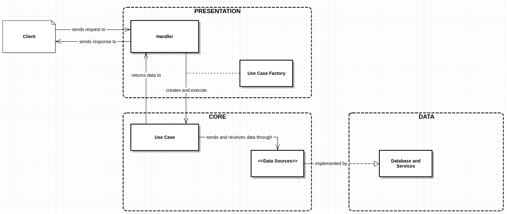
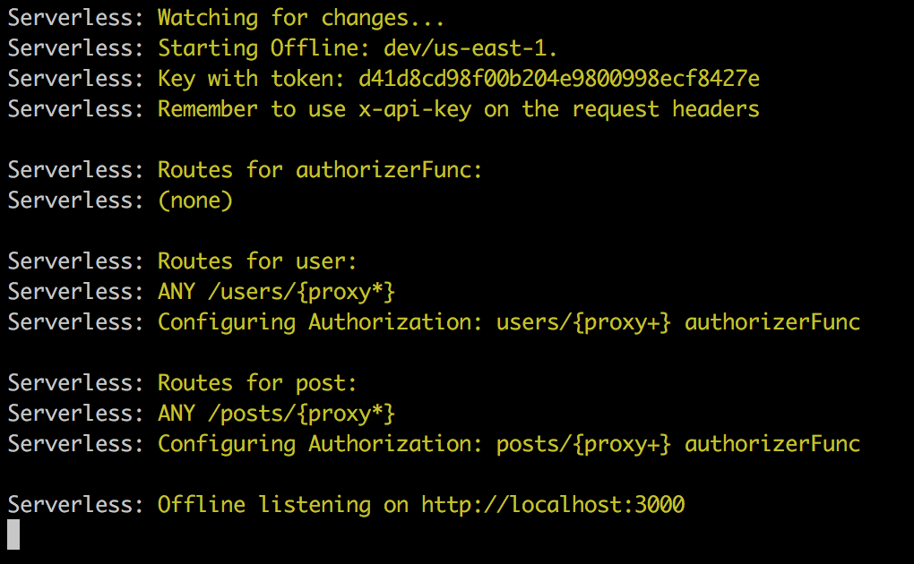

Índice de páginas relacionadas ao Backend:
## 1. Introduction

In this guide, we'll be explaining our backend structure, focusing on how the project is structured, what are the main funcionalities of our base project, and how to develop a new feature from scratch.

To fully understand this guide, you'll need to know the basics of Javascript, Typescript and the ES6 sintax. But don't worry, I got you covered, if don't know any of this subject you can read/watch some guides that can help you out:

- [Javascript with ES6](https://www.udemy.com/essentials-in-javascript-es6/)
- [Main ES6 features](https://webapplog.com/es6/)
- [Learn Typescript](https://tutorialzine.com/2016/07/learn-typescript-in-30-minutes)

## 2. A bottom-up approach

In Outsmart we use a serverless arquitecture, deploying all our services to AWS, which means that we don't have a dedicated server to host our backend, or even a dedicated virtual machine. All our functions are deployed in Lambda, an AWS feature that allows you to deploy code and add an event to trigger him.

To facilitate this process we use the [serverless framework](https://serverless.com/framework/docs/providers/aws/guide/intro/), this framework help us to automate our deploy, since we define a file that contains all our resouces, functions and events, and the framework take care of deploying them correctly into our AWS account.

We'll talk more about resources, events and a lot more about functions in this guide, but if you want to learn more about the serverless paradigm, the advantages and disadvantages, i recommend reading this articles:

- [What are Cloud Computing Services [IaaS, CaaS, PaaS, FaaS, SaaS]](https://medium.com/@nnilesh7756/what-are-cloud-computing-services-iaas-caas-paas-faas-saas-ac0f6022d36e)
- [What Is Function-as-a-Service? Serverless Architectures Are Here!](https://stackify.com/function-as-a-service-serverless-architecture/)
- [Serverless Architectures](https://martinfowler.com/articles/serverless.html)

## 3. A bit of data! How to properly use DynamoDB

Since we went full AWS (all our backend is structured using the AWS infrastructure), one of the main challenges was migrate to use DynamoDB, we were used to noSQL databases (we mainly used MongoDB before migrating), but don't fool yourself, even thought DynamoDB is a noSQL database it has a lot of differences from MongoDB.

DynamoDB has some optimizations that heavely favor the use of index in your tables, but to be cost-efficient you need to plan very well which columns of your tables you'll indexing. If you have some experience with different databases you might be confused now, tables, columns, indexes, this are common terms for SQL based databases.

Dynamo has a lot of SQL-like features, that are used to help you improve your database efficiency. For example, all tables must have a partition key, this key must be unique. In several use cases we need to create tables that don't have a primary unique key, dynamo let us define tables using the concept of sort keys.

### 3.1 Partition and Sort keys

As the name says the sort key is used to sort your data, and also used to create unique keys. When you create a table using this sort feature, your items don't need to have a unique key, but the pair (partition key + sort key) must be unique.

This is your most powerfull ally when developing backend features, since you get a more complex index, which contains two different information for your item, also allowing you to do indexed queries that are able to search in a sub-set of information, filtering and sorting then properly.

For example, imagine that you have a table that will save posts for some user, one approach you can take is creating a table that will have the userId as partition key and the creationDate(as a epoch timestamp) as sort key, this way you can easily query to get all the post for a specific user in a determined date range.

### 3.2 Global Secondary Indexes(GSI)

Indexing two columns of your database might not be enought, in some cases you have a lot information in a single table, and you need to search in it for different criterias, the GSI let you index different column (you can use the single column indexing or use the partion+sort index, which works exactly like the main table index).

Be carefull! Creating an index basically means that you are indexing the whole table again, so in terms of cost you are basically creating another table! Using indexes are usefull to help you solve some weird queries you need to do, but they are not the perfect solution, sometimes you solve your problem by creating another table containing a subset of information from this other table.

### 3.3 The query operation

As mention before the [Query operation](https://docs.aws.amazon.com/amazondynamodb/latest/APIReference/API_Query.html) is one of the most important operations of DynamoDB, since it let you search for a set of information that match some specific conditions. The query operation is really time efficient, it can be used in tables that contain partition+sort and in GSIs and it's the most common method for searching data in some table.

### 3.4 The get operation

The [GetItem operation](https://docs.aws.amazon.com/amazondynamodb/latest/APIReference/API_GetItem.html) can only be use in the primary index of a table, since this index contains unique keys if the operation finds a result it will only return one object.

### 3.5 The update and put operation

Both operations work similar, they are used to write data in Dynamo, [PutItem operation](https://docs.aws.amazon.com/amazondynamodb/latest/APIReference/API_PutItem.html) can be used both to create an item or overwrite and existing item. In the otherhand the [UpdateItem operation](https://docs.aws.amazon.com/amazondynamodb/latest/APIReference/API_UpdateItem.html) can only be used on an existing item, and it will only replace the provided properties of the item, i.e. the PutItem will completely replace your item, and the update will only change existing fields and add new ones.

### 3.6 The scan operation

Avoid this! The [Scan operation](https://docs.aws.amazon.com/amazondynamodb/latest/APIReference/API_Scan.html) is extremely inefficient, since it iterates over all your Table Items until it finds all the desired results. This can be extremely slow and expensive, so we avoid using this all costs.

### 3.7 Batch operations

The Get and Put operations have a "Batch" version, in which you can do several operations of Get or Put in parallel, it's a more optimized way of doing this operations, since Dynamo itself manage the writing/reading of data. Always prefer to use this instead of iterating promises or using a Promise.all sintax.

### 3.8 Pagination and the size of operations

All Dynamo operations have a limitation in the amount of data that can be fetch, in the normal operations you have a bite size limit, and the batch operations have a number based limit (i.e. 25 items per batch request). 

Because of this you have to consider for pagination problems in all your operations, Dynamo has a built-in pagination feature, also the library we use to help us use Dynamo abstract this for us. So if you don't explictily say that you want to paginate a query, it will iterate over a table until it fetch all the results, depending on the size of your table this might get really slow, so be carefull!

## 4. Authorization workflow using Cognito

Cognito is another AWS service that we use to that care of our applications authorization and authentication. There are some ways to use this feature, and we have used all of them.

Basically our signup process has two parts, first we register a user in Cognito, them we register him in our database. The signin need only to be done in Cognito, after that we use a token generated by cognito to authorize our endpoints.

At first we were doing the cognito signin and signup in our frontend, but we are completing migrating this to our backend. So how it works? We have an endpoint, which don't need authorization, that will do the user's signup, this endpoint will sign the user in cognito and in the database. Also it will return a token, which will be used in the subsequent requests.

This token is valid for an hour, and when it expires, any of our backend endpoints will automatically refresh it and return on the endpoint response. That way you will have a valid token for a month, after that you won't be able to refresh it and you'll need to signin again, which will also return a valid token.

## 5. serverless.yml and what you can do with it

The serverless framework uses an entry point file, called by default as serverless.yml, which defines all resources, functions, providers and anything you need to deploy in AWS. And how it works? Basically it will read your file and transtale it into CloudFormation sintax, CloudFormation is another AWS service that help us deploy anything into the AWS infrastructure.

With the help of this serverless.yml file and CloudFormation we can deploy any backend service with a single line (serverless deploy), but what exactily we can write in this file?

### 5.1 Functions

The main resource we will deploy is our functions and it's events, we need to basically define a handler (our typescript entry point) and a list of [events](https://serverless.com/framework/docs/providers/aws/events/), the most common event is the `http`, we use this to create all our endpoints, atributting a http method and a path to it.

Ex.:
```yml
functions:
  getUser:
    handler: src/user/getUser
    events:
      - http:
          method: get
          path: get-user
```

### 5.2 Providers

The provider definicions will need few ajustments during a project development, but it's really important to understand this part of file, since it makes the basic definitions for your whole project.

In the provider section of your file you can define the name of your provider(AWS, Azure, etc...), runtime (node, python), and your permissions, i.e. which AWS services your Lambda function will be able to access.

Ex.:
```yml
provider:
  name: aws
  runtime: nodejs8.10
  stage: dev
  iamRoleStatements:
    - Effect: "Allow"
      Action:
        - cognito-idp:*
        - dynamodb:*
      Resource: "*"
```

### 5.3 Resources

Here we will define any other resource that our cloudformation stack will create/update during our deploy, the most common resource we will create is our Dynamo tables (here you can check a list of all possible [resources](https://serverless.com/framework/docs/providers/aws/guide/resources/)), this is really important, since it will help us automate our production deploy.

Ex.:
```yml
backendUsersDev:
  Type: AWS::DynamoDB::Table
  Properties:
    TableName: BackendUsersDev
    AttributeDefinitions:
      - AttributeName: id
        AttributeType: S
      - AttributeName: username
        AttributeType: S
      - AttributeName: cpf
        AttributeType: S
    KeySchema:
      - AttributeName: id
        KeyType: HASH
      - AttributeName: username
        KeyType: RANGE
    ProvisionedThroughput:
      ReadCapacityUnits: 1
      WriteCapacityUnits: 1
    GlobalSecondaryIndexes:
      - IndexName: cpfTesteIndex
        KeySchema:
        - AttributeName: cpf
          KeyType: HASH
        Projection:
          ProjectionType: ALL
        ProvisionedThroughput:
          ReadCapacityUnits: 1
          WriteCapacityUnits: 1

```

## 6. Clean architecture and how our projects are structured

The Outsmart Backend project are structured following the [clean architecture](https://8thlight.com/blog/uncle-bob/2012/08/13/the-clean-architecture.html). So basically our project are divided in 3 layers: Presentation, Use Cases and Data Sources. I'll explain them brieffly, but keep in mind that this is just a simplification of the architecture:

### 6.1 Presentation

This layer is the most external layer of our application, it will intercept our request, normally it will parse the resquest body/params and validate the input. This layer is also responsible to instantiate UseCases, define which databases will be used, execute these UseCases and return the result.

### 6.2 Use Cases

It contains our business logic, it will receive an input from a Presentation, mutate it in order to attend any necessary logic, communicate with datasources, (which will provide some sort of data), and finally return a result back to the presentation.

### 6.3 Data Sources

These are definitions of our data access methods, i.e. a bunch of interfaces that tell which data we can request, what is the necessary input to require this data, and in which format this data will be returned.

For every project we need an implementation of these datasources, normally we use Dynamo as our main data provider, so inside our project there is `data` layer which contains all datasources implementations.

The application flow of control is illustrated below:


## 7. os-bob, all the constructions you'll need in one place

The [os-bob](https://bitbucket.org/appsimples/os-bob/src/master/) is a library, created by us, that will help you construct your backend projects, facilitating the amount of code you need to write. This lib have some funcionalities like DataSources Implementations, Authorizer, Router, Error Handler, Token Refresing, and more!

### 7.1 DataSources Implementations

Writing some simple Dynamo implementations and creating the Dynamo Schema can take a lot of time, so we basically created an Base DataSource implementation that already let you use some basic functions as getItem, putItem directly from your use case function, this way all the datasource implementation as abstrated for you. (This functionality only implements the dynamo operation for the given datasource interface)

### 7.2 Authorizer

This funcionality will give some wrapper that we will use in our presentation that will take care of all the authorization and authentication of an user. It provides some methods like signUp, signIn, forgotPassword and more.

Also this module implements all of our functions authorization, validating if a user's token is valid and allowing him to invoke the lambda function and doing stuff in our database.

### 7.3 Router

The Router creates a wrapper for our lambda functions that allow us to create services as lambdas that differentiates which handler will be called by the path associated to it.

Basically, we will have a single lambda, with a fixed http path (Ex.: A User lambda with a '/user' path), this lambda will invoke our router, which will analyse the second part of our path (Ex.: '/user/get-user'), and decide which handler to call.

### 7.4 Error Handler

This module will implement our error handling, basically it will help us to padronize our errors in a way that it's easier for front-end applications to understand any server side errors.

### 7.5 Token Refresing

This module works together with the Authorizer module, it will help us to manage if a token is valid, and if it's not valid, but it can be refreashed it will automatically refresh the token and authorize the user to access the lambda function.

## 8. Creating your first endpoint from scratch

So now we'll try to create a new endpoint, for this tutorial we'll have two scenarions, the first one assumes that we are creating a new service, and the second one assumes that we are only creating a new endpoint for an existing service. So first we'll make a 'create post' endpoint, after that we'll do a 'get post' endpoint, this are simple functions, but very common ones!

### 8.1 New service, new endpoint, new everything

First we need to add a new function in our serverless.yml, we only need need to copy a previous implementation and change a feel words (like the service name!), since this only defines the lambda you will rarely need to do anything different here.

```yml
functions:
  authorizerFunc:
    handler: src/authorizer/authorizer.handler
  user:
    handler: src/user/_router.router
    events:
      - http:
          method: any
          path: users/{proxy+}
          authorizer: ${self:custom.authorizer}
          private: true
  post:
    handler: src/post/_router.router
    events:
      - http:
          method: any
          path: posts/{proxy+}
          authorizer: ${self:custom.authorizer}
          private: true
```

Is important to note that we need to change our service name and our handler path(we will create this in the next step), also the method should stay as `any`, this is necessary in order to our Router access different handler with different http methods.

#### 8.1.1 Creating a new Router

Now we need to create our Router, but first we need to create all the folder structure for the new service, this is what looks after you create all folders:


Now we can write our _router file, first you'll need to create a new constant, normally called router(must be the same name you gave in the handler of your function declaration), this constant we instanciate the Router class of os-bos, it needs you to define two parameters, the `basePath` and the `routes` which is an array of Routes. Now you can add a list of routes inside this array, for this part we only add the `create-post` route.

```ts
import { Router, RequestMethod } from 'os-bob'
import { createPost, PostBody } from './presentation/createPost';
import { Post } from './presentation/models/post'

export const router = Router({
  basePath: 'posts',
  routes: [
    {
      path: 'create-post',
      method: RequestMethod.POST,
      handler: createPost,
      body: PostBody,
      outputBody: Post,
    },
  ],
})
```

#### 8.1.2 Creating your handler

After creating your router, we can write our presentation file, i.e. the handler of our function. Again, you need to create a file inside the presentation folder, this file will contain an simple constant with whatever name you want (normally just the oath name as camelCase), this constant will be a function that will follow the CustomHandler interface. Inside this function will have access to the body of our request, aswell as the id of the user doing the request.

```ts
import { CustomHandler } from 'os-bob'

export const createPost: CustomHandler = async (event, context, callback, validatedInput) => {
  console.log('hello world')
  console.log(validatedInput.body)
  return validatedInput.body
}
```

In this step we will create our input and output models, they might be different, for example, in this endpoint our input won't have the post id, since it will be generated by the server, but our Output will have this information and it is important to return it to our front end applications.

Also we can replace the missing classes in the router configuration and create our UseCase and execute it, this way, our presentation will be complete.

```ts
import { CustomHandler } from 'os-bob'
import { CreatePostUC } from '../core/useCases/createPost';

export const createPost: CustomHandler = async (event, context, callback, validatedInput) => {
  const useCase = new CreatePostUC(
    new PostDataBase(),
  )
  return useCase.execute({ id: validatedInput.uid, ...validatedInput.body })
}

export class PostBody {
  creatorName: string
  date: number
  description: string
}
```

#### 8.1.3 Writing your business logic

Now we can create our UseCase, there a lot of repeated code to declare this class, but basically we create a js class, it will implement the `UseCase` from `os-bob`, it will need a constructor that instantiate the DataSources for this UseCase, and finally it must have an `execute` function, which will be called by our presentation.

```ts
import { UseCase } from 'os-bob'
import { Post } from '../../presentation/models/post'

export class CreatePostUC implements UseCase<Post, Post> {
  constructor(
    private postDataSource: PostDataSource,
  ) {}

  public async execute(input: Post): Promise<Post> {
    // do you endpoint business logic here!
    return input
  }
}
```

Now we need to create our DataSource, which will contains all of our UseCases interfaces. This file contains an interface that extends the DataSource from `os-bob`, also it contains all the models that will be used in this operations.

```ts
import { DataSource } from 'os-bob'

export interface PostDataSource extends DataSource<PostDSKey, PostDSModel> {
  createPost(input: PostDSModel): Promise<void>
}

export interface PostDSKey {
  id: string
}

export interface PostDSModel extends PostDSKey {
  creatorName: string
  date: number
  description: string
}
```

So, we need to complete our UseCase, in order to use the interfaces we just defined, in this example we are using a single interface, but you might face some complex business logics that require you to access multiple datasources and mutate your data to conform the front-end requirements.

```ts
import { UseCase } from 'os-bob'
import { Post } from '../../presentation/models/post'
import { PostDataSource } from '../dataSources/postDataSource';

export class CreatePostUC implements UseCase<Post, Post> {
  constructor(
    private postDataSource: PostDataSource,
  ) {}

  public async execute(input: Post): Promise<Post> {
    await this.postDataSource.createPost(input)
    return input
  }
}

```

#### 8.1.4 Write an DataSource implementation

At this point, your endpoint is almost ready, the problem is that you still need to implement the functions of your data source. This means that we need to write some dynamo functions! To start we need to create a file in our `data` folder, also inside this folder there is another folder called `tabels`, this will contain all of our Dynamo tables declarations.

Let's start with the table definition, first we need to create a class, containing all of your table keys (this is not a one-time-only thing, you can change your model as much as you want), then you need to define an interface which will contain your Table Keys. Finally you need to create an constant that will have all your table configurations(we'll use this to create your table in dynamo).

```ts
import { getConfig, Schema } from '../../../../config';

export class PostTable {
  id: string
  creatorName: string
  date: number
  description: string
}

export interface PostTableKey {
  id: string
}

export const PostSchema: Schema = {
  partitionKey: 'id',
  tableName: getConfig().TABLES.POST_TABLE_NAME,
  // capacity is an optional parameter! For a list of all possible
  // parameters check the Schema interface
  capacity: {
    readCapacity: 3,
    writeCapacity: 1,
  },
}
```

Now we can create our datasource implementation! It will be a class that extends DynamoDatabase (from os-bob) and that implements your DataSource. In this class you need to write the constructor, passing as arguments to your `super()` function the table class, name, partition key, sort key and list of indexes (the last two are optionals).

You also need to implement the `toDB` and `toDS` functions, they are two mappers that will transform your data source model into your table model and vice-versa (if both models are the same this is a really simple function, but you might need to add some logic depending on your usecases and tables).

Finally you need to implement you datasources interfaces, for this you only need to use the same function declaration as the datasource file. In this functions you have access to the `repo` property, it contains all Dynamo method implemented by type-dynamo, an will probably be all you need to operate with dynamo.

```ts
import { DynamoDatabase } from 'os-bob'
import { getConfig } from '../../../config';
import { PostTable } from './tables/postTable'
import { PostDSKey, PostDSModel, PostDataSource } from '../core/dataSources/postDataSource';

export class PostDataBase extends DynamoDatabase<PostTable, PostDSKey, PostDSModel> implements PostDataSource {

  constructor() {
    super(
      PostTable,
      getConfig().TABLES.POST_TABLE_NAME,
      'id',
    )
  }

  toDB(input: PostDSModel): PostTable {
    return { 
      id: input.id,
      creatorName: input.creatorName,
      date: input.date,
      description: input.description,
    }
  }

  toDS(input: PostTable): PostDSModel {
    return {
      id: input.id,
      creatorName: input.creatorName,
      date: input.date,
      description: input.description,
    }
  }

  async createPost(input: PostDSModel): Promise<void> {
    await this.repo.save(input).execute()
    return
  }
}
```

And that all! You only need to fix some undeclared varibles you left behind, and you are ready to go! To test your endpoint just run the start command using `yarn start` (don't forget to install all dependecies running `yarn install`), if no compile errors are found you should see your endpoint in a list of functions printed in your terminal.



Now, it's time to try out our new function! Just run your request in Postman and everything should be working.


### 8.2 New endpoint for an old service

To create our second endpoint, the `get-post` endpoint, we need to replicate some steps from the previous tutorial, but we'll be able to skip some steps, so our development process should be lower.

#### 8.2.1 Creating your handler

We already have our service created, so we only need to update the current router file and create a new handler(it will be really similar to the previous presentation we created)

```ts
import { Router, RequestMethod } from 'os-bob'
import { createPost, PostBody } from './presentation/createPost';
import { Post } from './presentation/models/post'

export const router = Router({
  basePath: 'posts',
  routes: [
    {
      path: 'create-post',
      method: RequestMethod.POST,
      handler: createPost,
      body: PostBody,
      outputBody: Post,
    },
    {
      path: 'get-post',
      method: RequestMethod.GET,
      handler: getPost,
      outputBody: Post,
    },
  ],
})
```

```ts
import { CustomHandler } from 'os-bob'
import { GetPostUC } from '../core/useCases/getPost';
import { PostDataBase } from '../data/postDataBase';

export const createPost: CustomHandler = async (event, context, callback, validatedInput) => {
  const useCase = new GetPostUC(
    new PostDataBase(),
  )
  return useCase.execute(validatedInput.uid)
}
```

#### 8.2.2 Writing your business logic

Again, we need to create an UseCase file to contain our business logic, the template is the same as before, so let's just copy and paste to begin.

```ts
import { UseCase } from 'os-bob'
import { PostDataSource } from '../dataSources/postDataSource';

export class GetPostUC implements UseCase<string, string> {
  constructor(
    private postDataSource: PostDataSource,
  ) {}

  public async execute(input: string): Promise<string> {
    // Write your business logic here
    return input
  }
}
```

#### 8.2.3 Using another datasource implementation

Finally we can do another datasource implementation, which means that you would need to create another interface in your datasource file and it's implementation in your database file. In this example, we'll use a ready-to-use database implementation, but, what this means? os-bob already implement some common Dyanmo implementations that you can use directily in your usecase.

```ts
import { UseCase } from 'os-bob'
import { PostDataSource } from '../dataSources/postDataSource';
import { Post } from '../../presentation/models/post';

export class GetPostUC implements UseCase<string, Post> {
  constructor(
    private postDataSource: PostDataSource,
  ) {}

  public async execute(input: string): Promise<Post> {
    const post = this.postDataSource.getItem({ id: input })
    return post
  }
}
```
